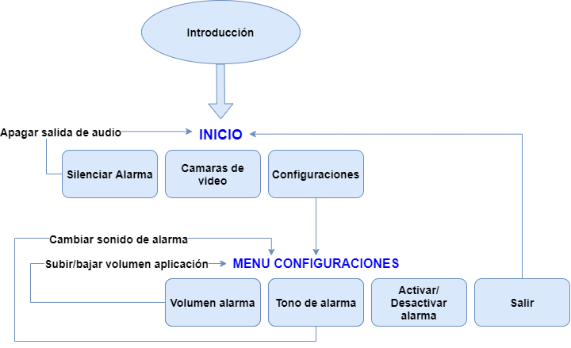
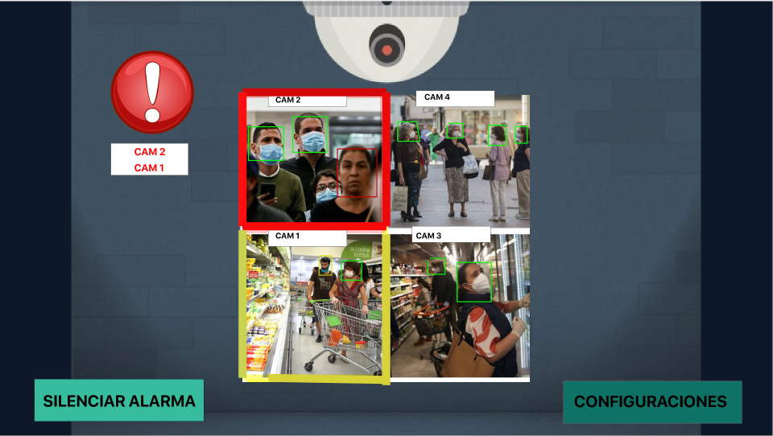
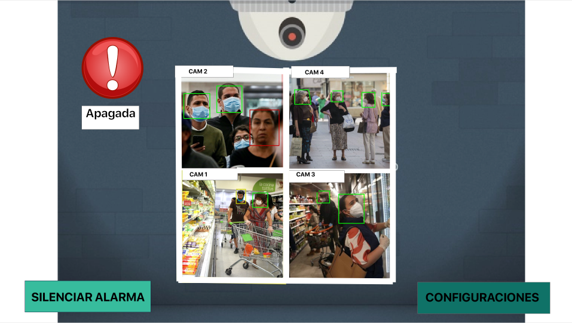
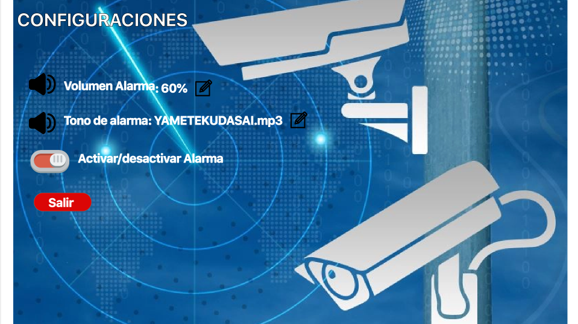

# Manual de usuario
Este manual de usuario fue creado con la finalidad de facilitar el uso del programa y orientar a nuevos usuarios que deseen saber con detalle como sacar el máximo potencial del software. Acá usted aprenderá el contenido de cada menú del programa y como puede moverse por ellos, además de un diagrama y un **Demo** para que pueda interactuar con el programa inmediatamente.

## Demo
Si usted desea ver el demo de este proyecto, puede visitar [Demo del proyecto](https://drive.google.com/drive/folders/1Uqnloj1RgeDTE--mkgo7rjpL8jrsFSHX?usp=sharing)

## Inicio
Posterior a la ejecución del programa, usted posee el menú de **Inicio** donde podrá encontrar lo siguiente:
* Silenciar alarma
* Cámaras de video
* Configuraciones 

## Menu Configuraciones
En el menú de **Configuraciones** usted podrá encontrar lo siguiente:
* Volumen alarma
* Tono de alarma
* Activar/Desactivar alarma
* salir (Para volver al menú de **Inicio**)

## Modelo de Navegación

## Preview

